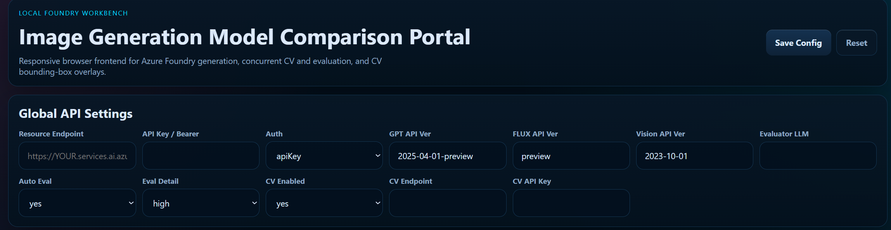
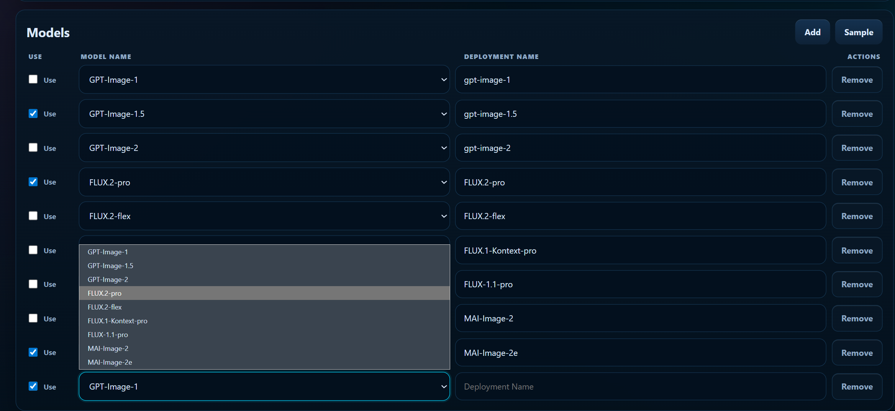
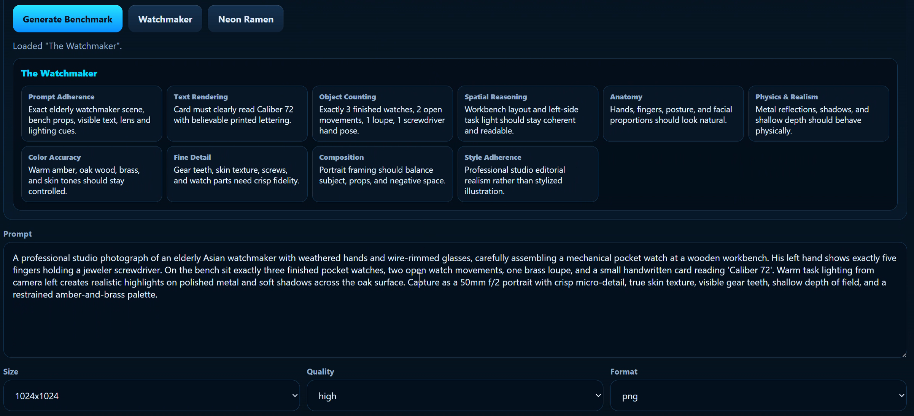
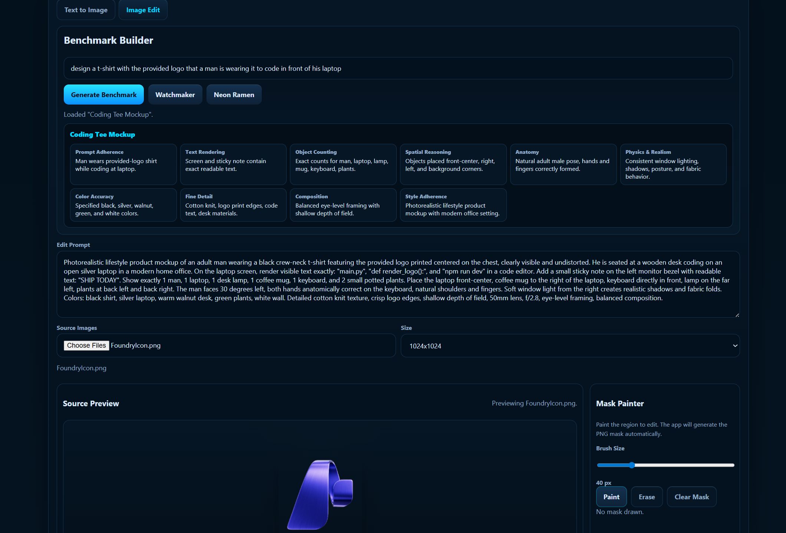
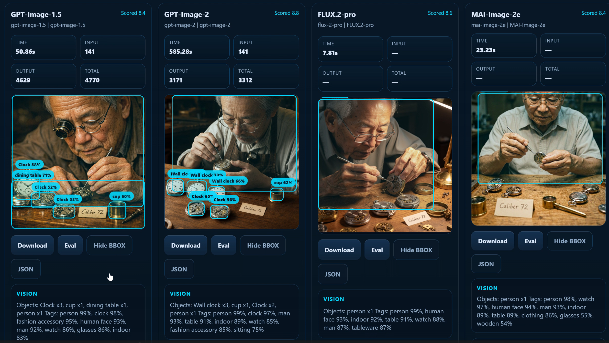
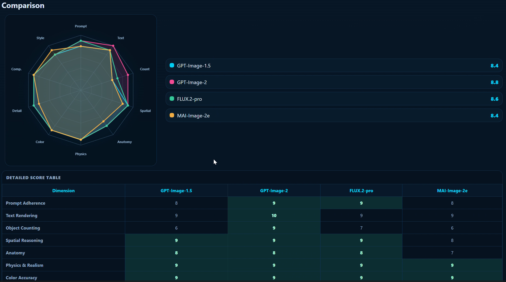
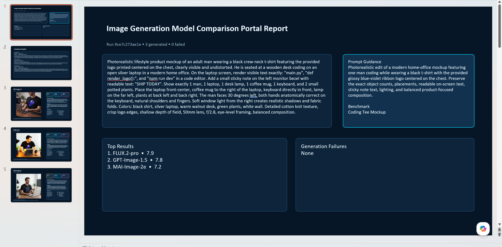

# Image Generation Model Comparison Portal

Image Generation Model Comparison Portal is an application for comparing image generation models side by side. It supports both text-to-image and image-edit workflows, benchmark prompt generation, concurrent evaluation, bounding-box visualization, and PPTX report export.

## What It Does

- Compares multiple image-generation deployments in one run.
- Supports text-to-image and image-edit benchmarking.
- Generates benchmark prompts and allows prompt refinement before execution.
- Runs generation, CV analysis, and evaluator scoring concurrently.
- Draws bounding boxes from CV output and lets users toggle them on or off.
- Provides retry actions for failed image generations.
- Exports generated images and evaluation results to PPTX.

## Evaluation Dimensions

Each generated image is scored on **10 dimensions**, with an integer score from **1 to 10** for each dimension. The portal also produces an **overall score**, plus short notes, strengths, weaknesses, and a summary for each result.

### 1. Prompt Adherence
Measures how well the image follows the requested scene, subject, objects, constraints, and intent from the prompt.

### 2. Text Rendering
Checks whether visible text in the image is readable, correctly spelled, and formed in a believable way.

### 3. Object Counting
Evaluates whether the image contains the correct number of requested objects, people, or repeated elements.

### 4. Spatial Reasoning
Measures whether objects appear in the right positions and relationships, such as foreground/background placement, left/right ordering, and scene layout.

### 5. Anatomy
Evaluates human or creature body coherence, including pose, gesture, limb placement, hand structure, body ratios, and visible finger counts.

Note:
For images containing people, this dimension does **not** depend heavily on face identity or facial sharpness, because safety filtering or model behavior may blur or suppress faces before analysis.

### 6. Physics & Realism
Checks whether lighting, shadows, reflections, gravity, material behavior, and scene interactions look physically believable.

### 7. Color Accuracy
Measures whether the requested palette, color relationships, and key visual tones are reproduced correctly and consistently.

### 8. Fine Detail
Evaluates sharpness and fidelity of small features such as textures, edges, materials, surface detail, and micro-structure.

### 9. Composition
Measures framing, balance, visual hierarchy, use of space, camera feel, and overall image aesthetics.

### 10. Style Adherence
Checks whether the generated image matches the requested artistic or photographic style, such as editorial realism, cinematic photography, illustration, or cyberpunk mood.

## How Scoring Works

- Each dimension receives a score from `1` to `10`
- The evaluator also returns a short note for every dimension
- An `overall_score` summarizes the image quality across all 10 dimensions
- The result may be augmented with Azure AI Vision analysis when CV is enabled
- Bounding boxes can be shown on top of the image when CV detects objects

## Requirements

- Python 3.11 or newer
- Access to Microsoft Foudnry to provision image generation model endpoints
- One evaluator deployment for benchmark generation and scoring. (e.g. GPT-5.4)
- Optional Azure AI Vision endpoint and key if you want CV analysis from a separate resource.
- One or more image-generation deployments to compare.

## Install And Run

The commands below assume a standard shell environment and a clone under your home directory.

```sh
git clone https://github.com/samsonlee0907/image-generation-model-comparison-portal.git
cd image-generation-model-comparison-portal
python3 -m venv .venv
source .venv/bin/activate
pip install -e .
image-generation-model-comparison-portal
```

The app starts a local server and opens in your browser automatically.

## Configure The App

Set these values before starting a comparison:

- `Resource Endpoint`
  Your Azure AI Foundry or Azure OpenAI endpoint.
- `API Key`
  The credential for that endpoint.
- `Evaluator LLM`
  The model used to generate benchmark prompts and score image quality.
- `CV Endpoint` and `CV API Key`
  Optional if you want to use a separate Azure AI Vision resource.
- Model rows
  Enable the image-generation deployments you want to compare and enter their deployment names.



- `Models`
  Choose the models that you'd like to compare across (provided that your endpoints have been created in Microsoft Foundry) through selecting the right models by name and enter the deployment name created.



## Text-To-Image Flow

1. Open the `Text to Image` tab.
2. Enter a prompt directly or use `Generate Benchmark`.
3. Optionally use the sample benchmark helpers.

4. Click `Generate and Compare`.
5. Review the generated image grid and evaluation output.


## Image Edit Flow

1. Open the `Image Edit` tab.
2. Upload a source image.
3. Paint the edit mask directly in the built-in mask panel.
4. Enter the edit prompt or generate a benchmark prompt.
5. Click `Generate Edit and Compare`.



## Results And Analysis

After a run, the portal shows:

- generated images
- CV and evaluator summaries
- per-dimension scoring
- radar visualization
- bounding box overlays
- retry actions for failed runs




## PPTX Reporting

Use `Export PPTX Report` to generate a presentation containing the run prompt, generated images, and evaluation results.


