# NoiseRemovalTestReport

> Standalone focused side-run report for prompt-guided noise/object removal image editing. This report is intentionally separate from `test-reports/aggregate-report.*`.

Generated from side-run artifacts captured `2026-06-19T09:31:55`. The run generated **5** source images with `gpt-image-2` at `quality=high`, `size=1024x1024`, then evaluated **30** model outputs across the six configured comparison models.

**Models compared:** `gpt-image-2`, `gpt-image-1.5`, `flux-2-pro`, `MAI-Image-2`, `MAI-Image-2.5`, `MAI-Image-2.5-Flash`

## Contents

- [Summary leaderboard](#summary-leaderboard)
- [Edit quality setup](#edit-quality-setup)
- [Source scenarios](#source-scenarios)
- [Grouped model results](#grouped-model-results)
- [Findings](#findings)

## Summary leaderboard

| Model | Family | Successful images | Fallbacks | Failures/gates | Overall | Noise removal | Preservation | Text preservation | Artifact control |
|---|---|---:|---:|---:|---:|---:|---:|---:|---:|
| MAI-Image-2.5-Flash | MAI-Image | 5 | 0 | 0 | 9.10 | 9.60 | 8.80 | 10.00 | 8.80 |
| MAI-Image-2.5 | MAI-Image | 5 | 0 | 0 | 9.06 | 9.60 | 9.00 | 9.00 | 8.60 |
| gpt-image-2 | GPT-Image | 5 | 0 | 0 | 9.00 | 9.80 | 8.40 | 9.80 | 8.60 |
| flux-2-pro | FLUX | 5 | 0 | 0 | 8.00 | 9.00 | 7.60 | 8.80 | 8.60 |
| gpt-image-1.5 | GPT-Image | 5 | 0 | 0 | 7.90 | 9.00 | 6.60 | 9.00 | 8.20 |
| MAI-Image-2 | MAI-Image | 5 | 5 | 0 | 3.20 | 3.00 | 2.00 | 5.80 | 5.80 |

## Edit quality setup

| Model | Recorded setup | Notes |
|---|---|---|
| gpt-image-2 | quality=high; size=1024x1024 | Native GPT-Image edit quality parameter was set to high. |
| gpt-image-1.5 | quality=high; size=1024x1024 | Native GPT-Image edit quality parameter was set to high. |
| flux-2-pro | steps=50; guidance=4.0; output_format=png | FLUX has no quality enum; the portal's high tier maps to steps=50 and guidance=4.0. |
| MAI-Image-2 | model=MAI-Image-2 | Model does not support image edit, so this is text-to-image fallback; MAI generation exposes no quality knob. |
| MAI-Image-2.5 | model=MAI-Image-2.5; source image attached | MAI edit route exposes no quality knob; native image-edit route was used at default/best available quality. |
| MAI-Image-2.5-Flash | model=MAI-Image-2.5-Flash; source image attached | MAI edit route exposes no quality knob; native image-edit route was used at default/best available quality. |

## Source scenarios

<table>
<thead><tr><th>Scenario</th><th>Original source image</th><th>Source prompt</th><th>Edit prompt</th></tr></thead>
<tbody>
<tr><td><strong>1. Park bottled drink ad</strong> <em>three unrelated pedestrians behind the subject</em></td><td>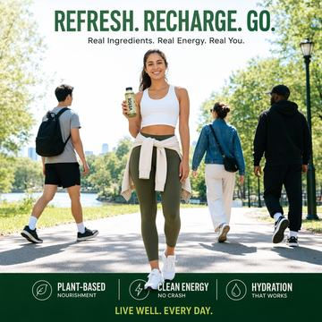</td><td>A high-resolution lifestyle advertisement photo of one person holding a bottled drink in a sunny park, centered full body, sharp clothing details, legible poster text at top and bottom, but with three unrelated pedestrians walking behind the subject, partially distracting from the composition.</td><td>Remove only the three unrelated pedestrians walking behind the centered person. Preserve the main person, bottled drink, full-body pose, clothing details, sunny park lighting, shadows, background geometry, composition, and all legible poster text at the top and bottom exactly as in the source image.</td></tr>
<tr><td><strong>2. Smartwatch product photo</strong> <em>crumbs, dust specks, fingerprints, two sticky notes</em></td><td>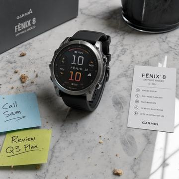</td><td>A studio product photo of a smartwatch on a marble desk with crisp reflections, exact brand-style label text on a small card, but with scattered crumbs, dust specks, fingerprints, and two random sticky notes cluttering the otherwise premium scene.</td><td>Remove only the scattered crumbs, dust specks, fingerprints, and the two random sticky notes. Preserve the smartwatch, marble desk, crisp reflections, premium studio lighting, shadows, camera angle, composition, and the exact brand-style label text on the small card.</td></tr>
<tr><td><strong>3. Hotel lobby cleanup</strong> <em>maintenance cones, mop bucket, loose cables</em></td><td>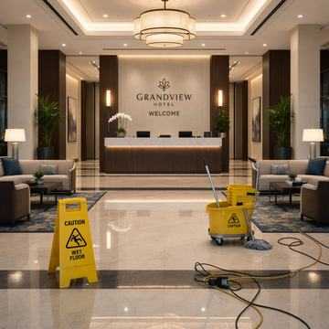</td><td>A clean modern hotel lobby with symmetrical furniture, warm lighting, polished floor reflections, and a readable welcome sign, but with maintenance cones, a mop bucket, and loose cables visible in the foreground.</td><td>Remove only the foreground maintenance cones, mop bucket, and loose cables. Preserve the clean modern hotel lobby, symmetrical furniture placement, warm lighting, polished floor reflections, background geometry, welcome sign readability, shadows, and composition.</td></tr>
<tr><td><strong>4. Dessert overhead cleanup</strong> <em>sauce splatters, crumbs, used napkin corner, stray fork</em></td><td>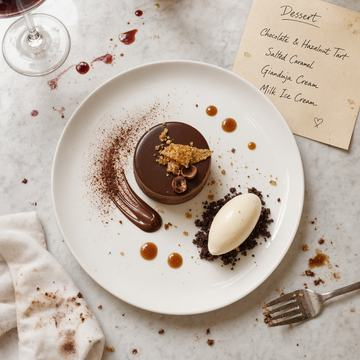</td><td>A professional overhead food photo of a plated dessert with precise garnish placement and a handwritten menu card, but with sauce splatters, crumbs, a used napkin corner, and a stray fork intruding into the frame.</td><td>Remove only the sauce splatters, crumbs, used napkin corner, and stray fork intruding into the frame. Preserve the plated dessert, precise garnish placement, overhead camera angle, handwritten menu card, lighting, shadows, plate geometry, background surface, and composition.</td></tr>
<tr><td><strong>5. Streetwear mural ad</strong> <em>graffiti stickers, trash bag, passersby, blurred bicycle</em></td><td>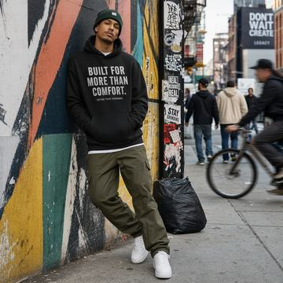</td><td>A cinematic streetwear ad photo of one model leaning against a colorful mural, sharp outfit textures and readable slogan text, but with graffiti stickers, a trash bag, passersby, and a blurred bicycle crossing the background.</td><td>Remove only the graffiti stickers, trash bag, passersby, and blurred bicycle crossing the background. Preserve the single model leaning pose, streetwear outfit textures, colorful mural geometry and colors, readable slogan text, cinematic lighting, shadows, depth of field, and overall composition.</td></tr>
</tbody>
</table>

## Grouped model results

Results are grouped by model family/type, then by model. Each row keeps the original source image on the left of the generated result for quick visual comparison.

### GPT-Image

#### gpt-image-2

Edit mode: **image edit** · setup: `quality=high; size=1024x1024`

<table>
<thead><tr><th>Scenario</th><th>Original source</th><th>Model output</th><th>Scores</th><th>Evaluator note</th></tr></thead>
<tbody>
<tr><td><strong>1. Park bottled drink ad</strong> <em>three unrelated pedestrians behind the subject</em></td><td></td><td>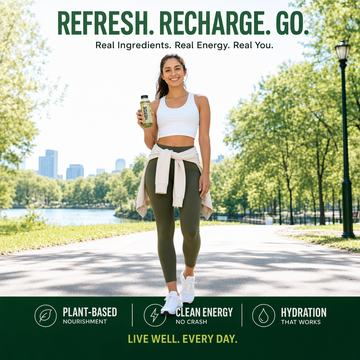</td><td>Overall 9.00 Noise 10.00 Preservation 8.00 Text 10.00 Artifacts 9.00</td><td>The edit successfully removes the three pedestrians while largely preserving the ad layout, subject, and text, with only small background reconstruction differences.</td></tr>
<tr><td><strong>2. Smartwatch product photo</strong> <em>crumbs, dust specks, fingerprints, two sticky notes</em></td><td></td><td>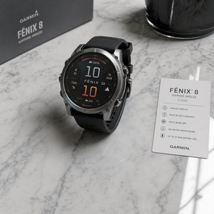</td><td>Overall 9.00 Noise 9.00 Preservation 9.00 Text 10.00 Artifacts 8.00</td><td>The cleanup is highly successful and preserves the product shot well, with only minor marble-surface reconstruction artifacts.</td></tr>
<tr><td><strong>3. Hotel lobby cleanup</strong> <em>maintenance cones, mop bucket, loose cables</em></td><td></td><td>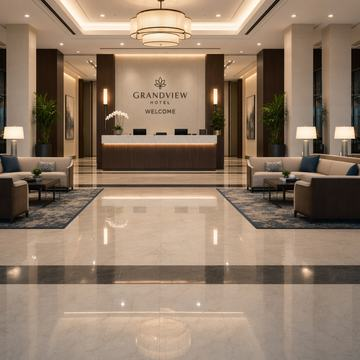</td><td>Overall 9.00 Noise 10.00 Preservation 9.00 Text 10.00 Artifacts 9.00</td><td>The edit successfully removes the specified maintenance clutter while keeping the lobby layout, lighting, reflections, and welcome sign largely intact.</td></tr>
<tr><td><strong>4. Dessert overhead cleanup</strong> <em>sauce splatters, crumbs, used napkin corner, stray fork</em></td><td></td><td>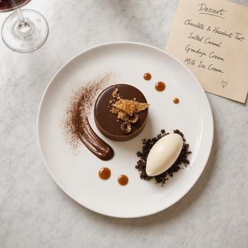</td><td>Overall 9.00 Noise 10.00 Preservation 8.00 Text 9.00 Artifacts 9.00</td><td>slight_background_pattern_change, minor_layout_shift, minor_handwriting_rerender</td></tr>
<tr><td><strong>5. Streetwear mural ad</strong> <em>graffiti stickers, trash bag, passersby, blurred bicycle</em></td><td></td><td>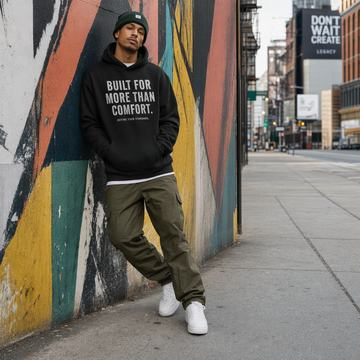</td><td>Overall 9.00 Noise 10.00 Preservation 8.00 Text 10.00 Artifacts 8.00</td><td>Strong targeted cleanup with excellent preservation of the slogan text and main scene, though subtle geometry and lower-body changes prevent a perfect result.</td></tr>
</tbody>
</table>

#### gpt-image-1.5

Edit mode: **image edit** · setup: `quality=high; size=1024x1024`

<table>
<thead><tr><th>Scenario</th><th>Original source</th><th>Model output</th><th>Scores</th><th>Evaluator note</th></tr></thead>
<tbody>
<tr><td><strong>1. Park bottled drink ad</strong> <em>three unrelated pedestrians behind the subject</em></td><td></td><td></td><td>Overall 8.00 Noise 9.00 Preservation 7.00 Text 10.00 Artifacts 8.00</td><td>Good targeted pedestrian removal and excellent text retention, but preservation is only moderate because the subject and park background were partially regenerated.</td></tr>
<tr><td><strong>2. Smartwatch product photo</strong> <em>crumbs, dust specks, fingerprints, two sticky notes</em></td><td></td><td>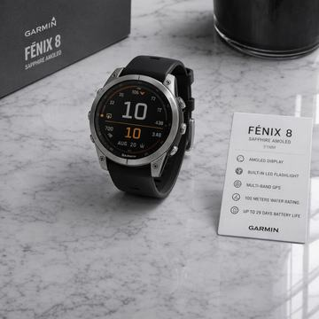</td><td>Overall 7.50 Noise 9.00 Preservation 6.00 Text 7.00 Artifacts 8.00</td><td>Cleanup is strong and visually clean, but the edit overreaches by subtly regenerating the watch and slightly changing the small-card text instead of preserving them exactly.</td></tr>
<tr><td><strong>3. Hotel lobby cleanup</strong> <em>maintenance cones, mop bucket, loose cables</em></td><td></td><td>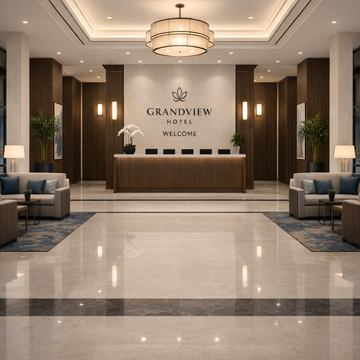</td><td>Overall 9.00 Noise 10.00 Preservation 8.00 Text 10.00 Artifacts 9.00</td><td>The cleanup was highly effective and artifact-free, with excellent object removal and text retention, though the edited lobby shows some subtle re-rendered structural differences from the original.</td></tr>
<tr><td><strong>4. Dessert overhead cleanup</strong> <em>sauce splatters, crumbs, used napkin corner, stray fork</em></td><td></td><td>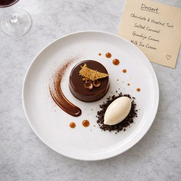</td><td>Overall 7.00 Noise 8.00 Preservation 5.00 Text 8.00 Artifacts 8.00</td><td>The edit removes the requested clutter well, but it over-edits the scene by re-rendering the dessert plating and slightly changing the menu card and composition.</td></tr>
<tr><td><strong>5. Streetwear mural ad</strong> <em>graffiti stickers, trash bag, passersby, blurred bicycle</em></td><td></td><td>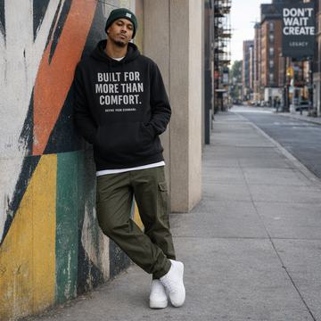</td><td>Overall 8.00 Noise 9.00 Preservation 7.00 Text 10.00 Artifacts 8.00</td><td>Cleanup is successful overall, but it slightly over-edits the background by replacing part of the original stickered wall/mural area rather than only removing the specified distractors.</td></tr>
</tbody>
</table>

### FLUX

#### flux-2-pro

Edit mode: **image edit** · setup: `steps=50; guidance=4.0; output_format=png`

<table>
<thead><tr><th>Scenario</th><th>Original source</th><th>Model output</th><th>Scores</th><th>Evaluator note</th></tr></thead>
<tbody>
<tr><td><strong>1. Park bottled drink ad</strong> <em>three unrelated pedestrians behind the subject</em></td><td></td><td>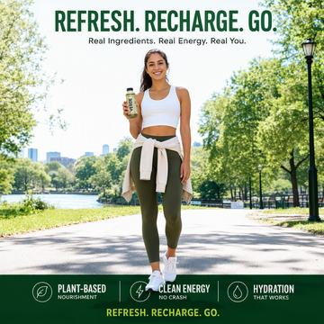</td><td>Overall 7.00 Noise 10.00 Preservation 8.00 Text 4.00 Artifacts 8.00</td><td>The edit cleanly removes the three pedestrians and preserves the subject well, but it fails the requirement to keep all poster text exactly the same because the bottom slogan was altered.</td></tr>
<tr><td><strong>2. Smartwatch product photo</strong> <em>crumbs, dust specks, fingerprints, two sticky notes</em></td><td></td><td>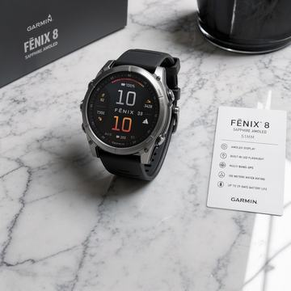</td><td>Overall 9.00 Noise 10.00 Preservation 9.00 Text 10.00 Artifacts 9.00</td><td>Excellent targeted cleanup: the requested distractors were removed while preserving the smartwatch scene, card text, and overall product-photo look.</td></tr>
<tr><td><strong>3. Hotel lobby cleanup</strong> <em>maintenance cones, mop bucket, loose cables</em></td><td></td><td>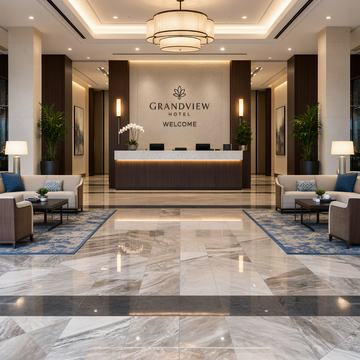</td><td>Overall 8.00 Noise 10.00 Preservation 7.00 Text 10.00 Artifacts 8.00</td><td>Excellent distractor removal and text preservation, but the cleanup noticeably altered the original floor surface and reflections.</td></tr>
<tr><td><strong>4. Dessert overhead cleanup</strong> <em>sauce splatters, crumbs, used napkin corner, stray fork</em></td><td></td><td>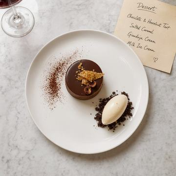</td><td>Overall 7.00 Noise 6.00 Preservation 6.00 Text 10.00 Artifacts 9.00</td><td>over_removal_of_intended_plating_elements, removed_non_target_chocolate_smear, removed_non_target_caramel_dots</td></tr>
<tr><td><strong>5. Streetwear mural ad</strong> <em>graffiti stickers, trash bag, passersby, blurred bicycle</em></td><td></td><td>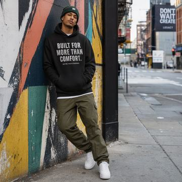</td><td>Overall 9.00 Noise 9.00 Preservation 8.00 Text 10.00 Artifacts 9.00</td><td>The cleanup is strong and preserves the ad well, but the sticker removal slightly over-simplified the adjacent wall/pillar area.</td></tr>
</tbody>
</table>

### MAI-Image

#### MAI-Image-2

Edit mode: **text-to-image fallback** · setup: `model=MAI-Image-2`

<table>
<thead><tr><th>Scenario</th><th>Original source</th><th>Model output</th><th>Scores</th><th>Evaluator note</th></tr></thead>
<tbody>
<tr><td><strong>1. Park bottled drink ad</strong> <em>three unrelated pedestrians behind the subject</em></td><td></td><td>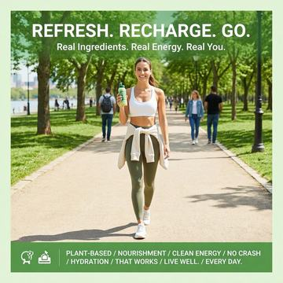</td><td>Overall 2.00 Noise 1.00 Preservation 2.00 Text 2.00 Artifacts 5.00</td><td>Fallback-to-text. distractors_not_removed, fallback_recomposition, subject_details_changed, background_geometry_changed, composition_changed, bottom_text_not_preserved, unwanted_additions</td></tr>
<tr><td><strong>2. Smartwatch product photo</strong> <em>crumbs, dust specks, fingerprints, two sticky notes</em></td><td></td><td>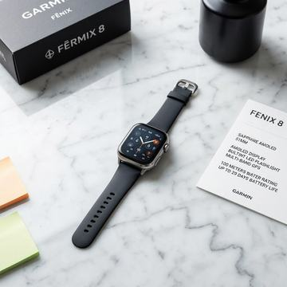</td><td>Overall 2.00 Noise 2.00 Preservation 1.00 Text 2.00 Artifacts 4.00</td><td>Fallback-to-text. While surface clutter is reduced, this is not a faithful cleanup edit because the source product, layout, and required text preservation were heavily changed.</td></tr>
<tr><td><strong>3. Hotel lobby cleanup</strong> <em>maintenance cones, mop bucket, loose cables</em></td><td></td><td>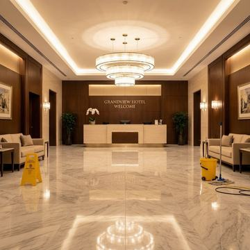</td><td>Overall 3.00 Noise 1.00 Preservation 2.00 Text 8.00 Artifacts 7.00</td><td>Fallback-to-text. This edit fails the cleanup task because the cone, mop bucket, and cables are still visible, and the source lobby was substantially regenerated instead of being preserved.</td></tr>
<tr><td><strong>4. Dessert overhead cleanup</strong> <em>sauce splatters, crumbs, used napkin corner, stray fork</em></td><td></td><td>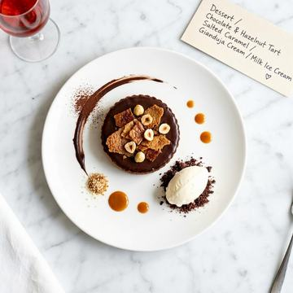</td><td>Overall 4.00 Noise 4.00 Preservation 2.00 Text 8.00 Artifacts 7.00</td><td>Fallback-to-text. The edit removes some tabletop mess, but it behaves like a regeneration rather than a cleanup—major dessert/plating details changed, the napkin and utensil still intrude, while the menu text remains readable.</td></tr>
<tr><td><strong>5. Streetwear mural ad</strong> <em>graffiti stickers, trash bag, passersby, blurred bicycle</em></td><td></td><td>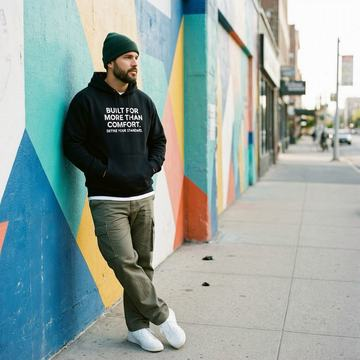</td><td>Overall 5.00 Noise 7.00 Preservation 3.00 Text 9.00 Artifacts 6.00</td><td>Fallback-to-text. Distractor removal worked, but preservation is poor because the edit reimagines the scene instead of cleanly removing only the requested elements.</td></tr>
</tbody>
</table>

#### MAI-Image-2.5

Edit mode: **image edit** · setup: `model=MAI-Image-2.5; source image attached`

<table>
<thead><tr><th>Scenario</th><th>Original source</th><th>Model output</th><th>Scores</th><th>Evaluator note</th></tr></thead>
<tbody>
<tr><td><strong>1. Park bottled drink ad</strong> <em>three unrelated pedestrians behind the subject</em></td><td></td><td>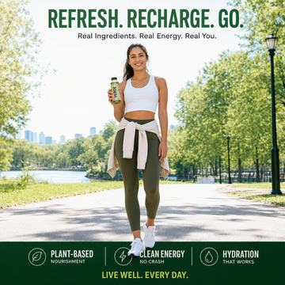</td><td>Overall 9.50 Noise 10.00 Preservation 9.00 Text 10.00 Artifacts 9.00</td><td>The edit successfully removes the three pedestrians while preserving the subject, ad layout, and readable poster text, with only minor inpainted background/shadow changes.</td></tr>
<tr><td><strong>2. Smartwatch product photo</strong> <em>crumbs, dust specks, fingerprints, two sticky notes</em></td><td></td><td>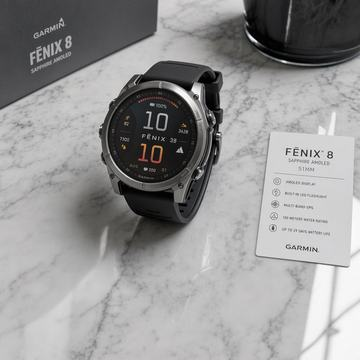</td><td>Overall 8.00 Noise 9.00 Preservation 8.00 Text 6.00 Artifacts 7.00</td><td>Strong targeted cleanup with good subject preservation, but the small card text fidelity dropped and the marble shows minor retouching artifacts.</td></tr>
<tr><td><strong>3. Hotel lobby cleanup</strong> <em>maintenance cones, mop bucket, loose cables</em></td><td></td><td></td><td>Overall 9.80 Noise 10.00 Preservation 10.00 Text 10.00 Artifacts 9.00</td><td>The edit cleanly removes the requested maintenance items while preserving the lobby’s structure, lighting, reflections, and readable welcome signage with only minimal inpainting traces.</td></tr>
<tr><td><strong>4. Dessert overhead cleanup</strong> <em>sauce splatters, crumbs, used napkin corner, stray fork</em></td><td></td><td>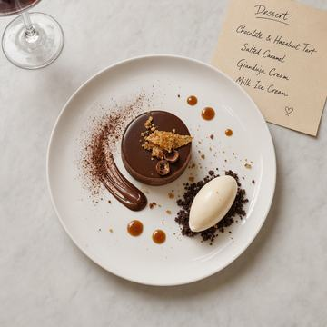</td><td>Overall 9.00 Noise 9.00 Preservation 9.00 Text 10.00 Artifacts 9.00</td><td>Strong targeted cleanup: the requested edge clutter is removed while the dessert scene and handwritten menu card stay largely intact, with only minor residual specks remaining.</td></tr>
<tr><td><strong>5. Streetwear mural ad</strong> <em>graffiti stickers, trash bag, passersby, blurred bicycle</em></td><td></td><td>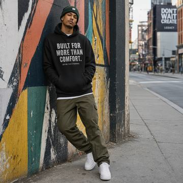</td><td>Overall 9.00 Noise 10.00 Preservation 9.00 Text 9.00 Artifacts 9.00</td><td>The edit successfully removes the stickers, trash bag, passersby, and bicycle while preserving the core subject, mural ad look, and legible text with only minor background regeneration.</td></tr>
</tbody>
</table>

#### MAI-Image-2.5-Flash

Edit mode: **image edit** · setup: `model=MAI-Image-2.5-Flash; source image attached`

<table>
<thead><tr><th>Scenario</th><th>Original source</th><th>Model output</th><th>Scores</th><th>Evaluator note</th></tr></thead>
<tbody>
<tr><td><strong>1. Park bottled drink ad</strong> <em>three unrelated pedestrians behind the subject</em></td><td></td><td>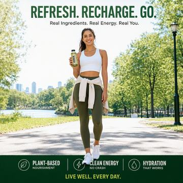</td><td>Overall 9.50 Noise 10.00 Preservation 9.00 Text 10.00 Artifacts 9.00</td><td>The edit successfully removes the three pedestrians with strong preservation of the ad layout, subject, and text, showing only minor background smoothing where people were filled in.</td></tr>
<tr><td><strong>2. Smartwatch product photo</strong> <em>crumbs, dust specks, fingerprints, two sticky notes</em></td><td></td><td>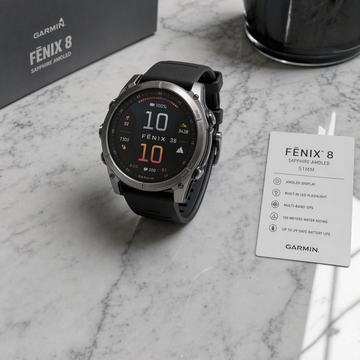</td><td>Overall 9.00 Noise 9.00 Preservation 9.00 Text 10.00 Artifacts 9.00</td><td>A strong cleanup edit that removes the requested distractors while preserving the product scene and label text, with only minor surface reconstruction artifacts.</td></tr>
<tr><td><strong>3. Hotel lobby cleanup</strong> <em>maintenance cones, mop bucket, loose cables</em></td><td></td><td></td><td>Overall 9.00 Noise 10.00 Preservation 9.00 Text 10.00 Artifacts 9.00</td><td>The edit successfully removes the requested maintenance clutter while preserving the lobby layout, lighting, reflections, and readable welcome sign, with only slight foreground floor retouching artifacts.</td></tr>
<tr><td><strong>4. Dessert overhead cleanup</strong> <em>sauce splatters, crumbs, used napkin corner, stray fork</em></td><td></td><td>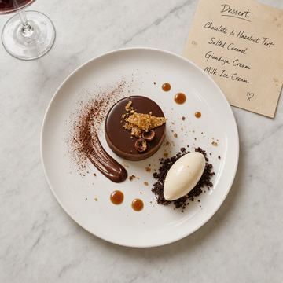</td><td>Overall 9.00 Noise 10.00 Preservation 9.00 Text 10.00 Artifacts 9.00</td><td>Excellent targeted cleanup with strong preservation of the dessert scene and handwritten menu card, with only subtle retouch traces.</td></tr>
<tr><td><strong>5. Streetwear mural ad</strong> <em>graffiti stickers, trash bag, passersby, blurred bicycle</em></td><td></td><td>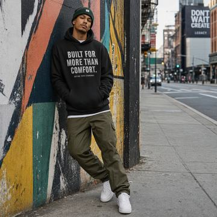</td><td>Overall 9.00 Noise 9.00 Preservation 8.00 Text 10.00 Artifacts 8.00</td><td>minor_background_reconstruction, slightly_over_simplified_streetscape</td></tr>
</tbody>
</table>

## Findings

- Best overall cleanup score: MAI-Image-2.5-Flash (9.10/10 overall, 9.60/10 noise removal).
- Lowest overall cleanup score among image-producing rows: MAI-Image-2 (3.20/10 overall).
- Fallback behavior observed for: MAI-Image-2; these rows are useful negative controls for true image-edit capability.
- No model returned a hard failure or no-image response in this run.
- All 30 result rows have focused-evaluator scores after repairing three evaluator JSON-parse retries.
- No hard request failures, safety gates, or HTTP-200 no-image responses were observed.
